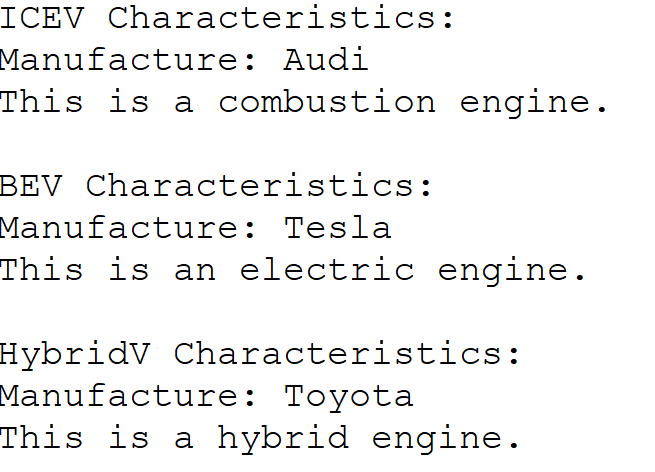

# Java Homework Assignment 3 Description
**Matriculation Number: 7221539**

**Development Environment: Windows 11 x64, Eclipse 2023-06, Java 17**

- Engine Class and Its Subclasses: An abstract superclass Engine is created, along with three subclasses—CombustionEngine (internal combustion engine), ElectricEngine (electric motor), and HybridEngine (hybrid engine)—representing different types of engines.
- Manufacture Class: Contains information about the manufacturer (such as name and country) and provides setter and getter methods for all its attributes.
- Vehicle Class and Its Subclasses: An abstract superclass Vehicle is created, which includes an abstract method ShowCharacteristics(). Three subclasses are then created: ICEV (Internal Combustion Engine Vehicle), BEV (Battery Electric Vehicle), and HybridV (Hybrid Vehicle). Each subclass has attributes of Manufacture and Engine.
- Vehicle Array and Display Method: A Vehicle array containing objects of ICEV, BEV, and HybridV is created. By iterating over this array, the ShowCharacteristics() method of each object is called to display the characteristics of the vehicles.